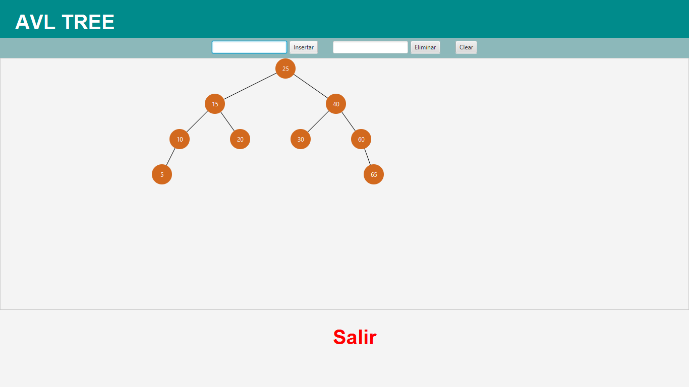

# AVL TREE

[![language][language-shield]][language-url]
[![Codacy Badge][codacybadge-shield]][codacybadge-url]
[![repoSize][repoSize-shield]][repo]
[![Contributors][contributors-shield]][contributors-url]
[![forks][forks-shield]][forks-url]
[![Stargazers][stars-shield]][stars-url]
[![Issues][issues-shield]][issues-url]
[![lastCommit][lastCommit-shield]][lastCommit-url]
[![LinkedIn][linkedin-shield]][linkedin-url]
[![Twitter][twitter-shield]][twitter-url]

**AVL TREE** is an application developed on Java that simulate the behavior of an Avl Tree, with the aim of the user learn in a better way how an Avl works.



## The Tree

The Avl tree is a search binary tree wich we can use to represent information hierarchically. This tree is also self balancing, that means that the tree is always balanced, in such a way that for every node the difference of the heigh of left branch and the heigh of right branch is at most one.

The representation of the avl tree in this application is only to save integers, but in an Avl Tree you can save any data type that can be comparable.

### Rules

As [freecodecamp](https://www.freecodecamp.org/news/avl-tree-insertion-rotation-and-balance-factor/) describes, a search binary tree is a TDA composed of nodes that have the following rules:

 1. Each has a root node at the top.

 2. Every node has at the most, two children.

 3. Every node has only one parent (the root is the one node that has no parents).

 4. For each node, its left child is less or equal than the node, wich is less or equal than its right child.

And the Avl tree has additionally this rule:

 1. The difference between the depth of right and left subtrees cannot be more than one. In order to maintain this guarantee, an implementation of an AVL will include an algorithm to rebalance the tree when adding an additional element would upset this guarantee.

There are several algotihm to aim that, a few of these are: LL rotation, RR rotation, LR rotation and RL rotation, you can watch all these algorithsm to balance the tree in this [video](https://www.youtube.com/watch?v=7m94k2Qhg68).

## Avl-tree 🔥

In this aplication you have three options to experiment with the tree, you have the option to add a new node, the option to remove a node, and you can also clear the tree removing all the nodes of the current tree.

The aplication behind the scenes will aply all the rules and algorithms to keep balanced the tree.

## Prerequisites 📋

You should have the java virtual machine installed(JVM) on your computer to run the game, if you do not have the java virtual machine you could install it from [here](https://www.java.com/es/download/).

### Installation 🔧

You only need to download this project.
To run the game you need to get into the folder "dist", which is in the root directory, and then execute the "Avl-Tree.jar" file.

Or you can also run this from the shell, you need to cd to the project folder, and then execute:

```bash
java -jar dist/Avl-Tree.jar
```

## Built with 🛠️

* Java8
* JavaFx

[language-shield]: https://img.shields.io/badge/Java-v1.8.0-blue?style=plastic
[language-url]: https://www.java.com/es/download/
[codacybadge-shield]: https://img.shields.io/codacy/grade/3c17ebf7c1954006a60b08b8af2c58e2?style=plastic
[codacybadge-url]: https://www.codacy.com/manual/AlexVelezLl/AVL-TREE?utm_source=github.com&amp;utm_medium=referral&amp;utm_content=AlexVelezLl/AVL-TREE&amp;utm_campaign=Badge_Grade
[repoSize-shield]: https://img.shields.io/github/repo-size/AlexVelezLl/AVL-TREE?style=plastic
[repo]: https://github.com/AlexVelezLl/AVL-TREE
[contributors-shield]: https://img.shields.io/github/contributors/AlexVelezLl/AVL-TREE?style=plastic
[contributors-url]: https://github.com/AlexVelezLl/AVL-TREE/graphs/contributors
[forks-shield]: https://img.shields.io/github/forks/AlexVelezLl/AVL-TREE?style=plastic
[forks-url]: https://github.com/AlexVelezLl/AVL-TREE/network/members
[stars-shield]: https://img.shields.io/github/stars/AlexVelezLl/AVL-TREE?style=plastic
[stars-url]: https://github.com/AlexVelezLl/AVL-TREE/stargazers
[issues-shield]: https://img.shields.io/github/issues/AlexVelezLl/AVL-TREE?style=plastic
[issues-url]: https://github.com/AlexVelezLl/AVL-TREE/issues
[lastCommit-shield]: https://img.shields.io/github/last-commit/AlexVelezLl/AVL-TREE?style=plastic
[lastCommit-url]: https://github.com/AlexVelezLl/AVL-TREE/commits
[linkedin-shield]: https://img.shields.io/badge/-LinkedIn-black.svg?style=plastic&logo=linkedin&colorB=555
[linkedin-url]:https://www.linkedin.com/in/alex-velez-llaque-4b3327191/
[twitter-shield]:https://img.shields.io/twitter/follow/AlexVelezLl?label=Follow&style=social
[twitter-url]:https://twitter.com/AlexVelezLl
